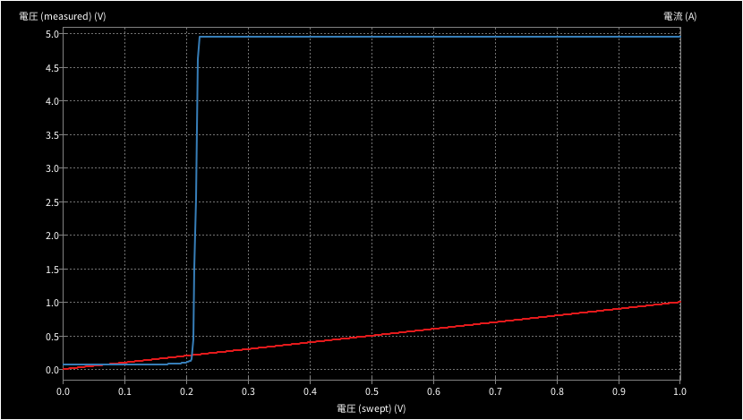

# NJM2903_Non-inverting_comparator_circuit_with_hysteresis

Author: Masafumi Horimoto

Voltage Amplifier & Comparator for CTT-10-CLS-CV-25

## Devices

Comparator [NJM2903D](https://akizukidenshi.com/catalog/g/g113486/)

## Simulation results

The CTT-10-CLS-CV-25 outputs 5V at 25A. If it detects 1A, it will fix the output at a 4V level if it detects a threshold of 0.2V.

